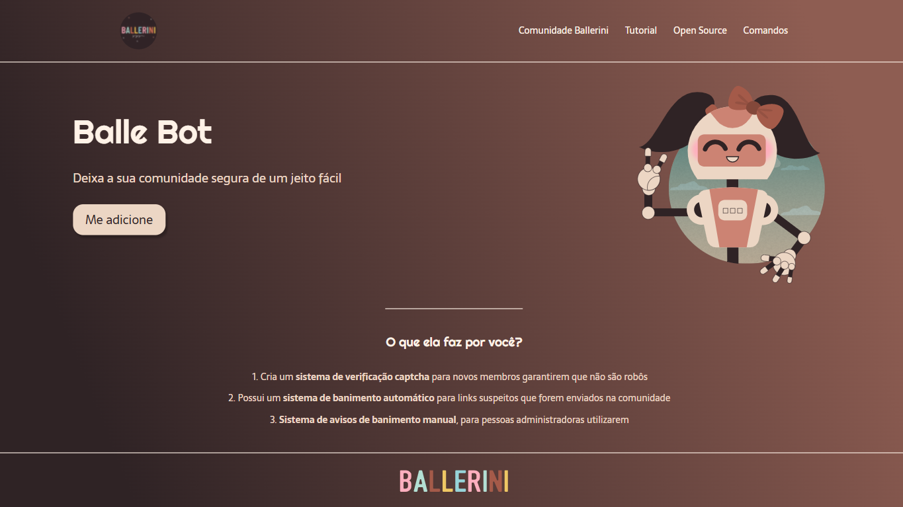

<H1 align="center">BALLERINI BOT LANDING PAGE</H1>

<h2 align="center">Summary</h2>

    <a href="#about">📙 About</a>
    <a href="#technologies">💻 Technologies</a>

<h4 align="center">
   ✔️ Ballerini Bot project finished ✔️
</h4>

<H2 id="about">📙 About</H2>

Simple landing page design with smooth hover transitions on buttons. Layout used to practice html and css concepts

Originally created by <a href="https://github.com/rafaballerini">Rafaella Balerini</a> and made by <a href="https://www.linkedin.com/in/kleverson-kenji-iwatani/">Kenji Iwatani</a>

<section align="center">
    
</section>

---

<H2 id="technologies">💻 Technologies</H2>

- [x] HTML
- [x] CSS
